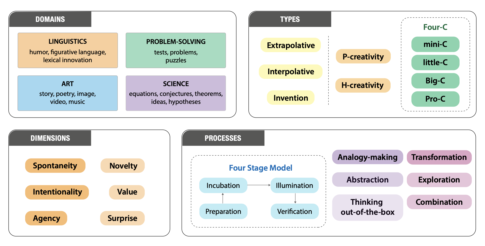

    

<h1 align="center">Creativity in AI: Progresses and Challenges</h1>

    <b>Curated collection of papers and resources on the state of creativity in AI (as of Nov 2024)</b>

  
  

🗂️ Table of Contents

<ul>
<li><a href="#creativity">Creativity</a><ul>
<li><a href="#definitions">Definitions</a></li>
<li><a href="#theories-and-processes">Theories and Processes</a></li>
<li><a href="#evaluation">Evaluation</a><ul>
<li><a href="#manual">Manual</a></li>
<li><a href="#automated">Automated</a><ul>
<li><a href="#novelty">Novelty</a></li>
<li><a href="#value">Value</a></li>
<li><a href="#surprise">Surprise</a></li>
</ul>
</li>
</ul>
</li>
<li><a href="#creative-process">Creative Process</a></li>
</ul>
</li>
<li><a href="#linguistic-creativity">Linguistic Creativity</a><ul>
<li><a href="#humor">Humor</a><ul>
<li><a href="#joke">Joke</a></li>
<li><a href="#pun">Pun</a></li>
<li><a href="#sarcasm">Sarcasm</a></li>
</ul>
</li>
<li><a href="#figurative-language">Figurative Language</a><ul>
<li><a href="#metaphor">Metaphor</a></li>
<li><a href="#simile">Simile</a></li>
<li><a href="#idiom">Idiom</a></li>
<li><a href="#hyperbole">Hyperbole</a></li>
</ul>
</li>
<li><a href="#lexical-innovation">Lexical Innovation</a></li>
</ul>
</li>
<li><a href="#creative-problem-solving">Creative Problem-Solving</a><ul>
<li><a href="#convergent-thinking">Convergent Thinking</a></li>
<li><a href="#divergent-thinking">Divergent Thinking</a></li>
<li><a href="#abstraction">Abstraction</a></li>
<li><a href="#analogy-making">Analogy-Making</a><ul>
<li><a href="#word-analogies">Word Analogies</a></li>
<li><a href="#sentence-analogies">Sentence Analogies</a></li>
<li><a href="#story-analogies">Story Analogies</a></li>
<li><a href="#visual-analogies">Visual Analogies</a></li>
<li><a href="#scientific-analogies">Scientific Analogies</a></li>
<li><a href="#analogical-reasoning">Analogical Reasoning</a></li>
</ul>
</li>
</ul>
</li>
<li><a href="#artistic-creativity">Artistic Creativity</a><ul>
<li><a href="#story-generation">Story Generation</a><ul>
<li><a href="#datasets">Datasets</a></li>
<li><a href="#methods">Methods</a></li>
</ul>
</li>
<li><a href="#poetry">Poetry</a><ul>
<li><a href="#datasets_1">Datasets</a></li>
<li><a href="#methods_1">Methods</a></li>
</ul>
</li>
<li><a href="#visual-creativity">Visual Creativity</a><ul>
<li><a href="#image-editing">Image Editing</a></li>
<li><a href="#text-to-image">Text-to-Image</a></li>
<li><a href="#video-generation">Video Generation</a></li>
</ul>
</li>
<li><a href="#musical-creativity">Musical Creativity</a></li>
</ul>
</li>
<li><a href="#scientific-creativity">Scientific Creativity</a><ul>
<li><a href="#equation-discovery-symbolic-regression">Equation Discovery &amp; Symbolic Regression</a></li>
<li><a href="#knowledge-discovery">Knowledge Discovery</a></li>
<li><a href="#scientific-process-automation">Scientific Process Automation</a></li>
</ul>
</li>
<li><a href="#creativity-and-copyright">Creativity and Copyright</a></li>
<li><a href="#creative-decoding">Creative Decoding</a></li>
<li><a href="#creative-prompt-engineering">Creative Prompt Engineering</a></li>
<li><a href="#creative-architectures">Creative Architectures</a></li>
<li><a href="#surveys">Surveys</a></li>
<li><a href="#tutorials">Tutorials</a></li>
</ul>

 
For more information, check out our [paper](https://arxiv.org/abs/2410.17218).

## Creativity
1. **[Can AI Be as Creative as Humans?](None)**

    *Haonan Wang, James Zou, Michael Mozer, Anirudh Goyal, Alex Lamb, Linjun Zhang, Weijie J Su, Zhun Deng, Michael Qizhe Xie, Hannah Brown, Kenji Kawaguchi*

    <u></u> 2024

1. **[Computational Creativity: The Philosophy and Engineering of Autonomously Creative Systems](https://books.google.ch/books?id=EBY1ygEACAAJ)**

    *T. Veale, F.A. Cardoso*

    <u>Springer.</u> 2019

1. **[On the Creativity of Large Language Models](https://api.semanticscholar.org/CorpusID:257913327)**

    *Giorgio Franceschelli, Mirco Musolesi*

    <u>ArXiv.</u> 2023

1. **[Computational Creativity: The Final Frontier?](https://api.semanticscholar.org/CorpusID:5880786)**

    *Simon Colton, Geraint A. Wiggins*

    <u>European Conference on Artificial Intelligence.</u> 2012

1. **[Minimally Creative Thought](http://www.jstor.org/stable/24439973)**

    *Dustin Stokes*

    <u>Metaphilosophy. Wiley.</u> 2011

1. **[The Philosophy of Creativity](https://compass.onlinelibrary.wiley.com/doi/abs/10.1111/j.1747-9991.2010.00351.x)**

    *Berys Gaut*

    <u>Philosophy Compass.</u> 2010

### Definitions
1. **['Explicating "Creativity"](None)**

    *Paisley Livingston*

    <u>Routledge Handbook on Creativity and Philosophy. Routledge.</u> 2018

1. **[On the Usefulness of “Value” in the Definition of Creativity](https://api.semanticscholar.org/CorpusID:146831140)**

    *Robert Weisberg*

    <u>Creativity Research Journal.</u> 2015
  
1. **[The Standard Definition of Creativity](https://doi.org/10.1080/10400419.2012.650092)**

    *Mark A. Runco, Garrett J. Jaeger*

    <u>Creativity Research Journal. Routledge.</u> 2012

1. **[{Creativity Naturalized}](https://doi.org/10.1111/j.1467-9213.2009.637.x)**

    *Maria E. Kronfeldner*

    <u>The Philosophical Quarterly.</u> 2009

1. **[The Creative Mind: Myths and Mechanisms](https://books.google.ch/books?id=6Zkm4dz32Y4C)**

    *M.A. Boden*

    <u>Routledge.</u> 2004

1. **[What it Means to be Creative](https://api.semanticscholar.org/CorpusID:191484364)**

    *Rudolf Arnheim*

    <u>British Journal of Aesthetics.</u> 2001

1. **[Creating Creativity: 101 Definitions (what Webster Never Told You)](https://books.google.ch/books?id=M2QpAAAACAAJ)**

    *A.G. Aleinikov, S. Kackmeister, R. Koenig*

    <u>Alden B. Dow Creativity Center Press.</u> 2000

1. **[Creativity and Constraint](https://doi.org/10.1080/00048409912348811)**

    *David Novitz*

    <u>Australasian Journal of Philosophy. Routledge.</u> 1999

1. **[The disposition toward originality](https://api.semanticscholar.org/CorpusID:30102436)**

    *Frank Barron*

    <u>The Journal of Abnormal and Social Psychology. American Psychological Association.</u> 1955

1. **[Creativity and culture](https://api.semanticscholar.org/CorpusID:144504562)**

    *Morris I Stein*

    <u>Creativity in Art, Religion, and Culture</u> 1953

### Theories and Processes
1. **[Characterising the Creative Process in Humans and Large Language Models](https://arxiv.org/abs/2405.00899)**

    *Surabhi S. Nath, Peter Dayan, Claire Stevenson*

    <u></u> 2024
  
1. **[Theories of Creativity](https://www.researchgate.net/publication/358294937_Theories_of_Creativity)**

    *Ronald Beghetto, James Kaufman*

    <u></u> 2022

1. **[A Triangular Theory of Creativity](None)**

    *Robert Sternberg*

    <u>Psychology of Aesthetics, Creativity, and the Arts.</u> 2016
    
1. **[Rewriting the Language of Creativity: The Five A's Framework](https://api.semanticscholar.org/CorpusID:143404705)**

    *Vlad Petre Glăveanu*

    <u>Review of General Psychology.</u> 2013

1. **[Personality and Creativity: The Dual Pathway to Creativity Model and a Research Agenda](None)**

    *Matthijs Baas, Marieke Roskes, Daniel Sligte, Bernard Nijstad, Carsten De Dreu*

    <u>Social and Personality Psychology Compass.</u> 2013

1. **[Computational Creativity Theory: The FACE and IDEA Descriptive Models](https://api.semanticscholar.org/CorpusID:522774)**

    *Simon Colton, John William Charnley, Alison Pease*

    <u>International Conference on Innovative Computing and Cloud Computing.</u> 2011

1. **[The dual pathway to creativity model: Creative ideation as a function of flexibility and persistence](https://api.semanticscholar.org/CorpusID:145290967)**

    *Bernard A. Nijstad, C. D. De Dreu, Eric F. Rietzschel, Matthijs Baas*

    <u>European Review of Social Psychology.</u> 2010

1. **[Formal Theory of Creativity, Fun, and Intrinsic Motivation (1990–2010)](https://ieeexplore.ieee.org/document/5508364)**

    *Jürgen Schmidhuber*

    <u>IEEE Transactions on Autonomous Mental Development.</u> 2010

1. **[Beyond Big and Little: The Four C Model of Creativity](https://doi.org/10.1037/a0013688)**

    *James C. Kaufman, Ronald A. Beghetto*

    <u>Review of General Psychology.</u> 2009

1. **[Creativity In Context: Update To The Social Psychology Of Creativity](https://books.google.ch/books?id=pZI4DgAAQBAJ)**

    *T.M. Amabile*

    <u>Avalon Publishing.</u> 1996

1. **[The Creative Cognition Approach](https://books.google.ch/books?id=iEMWI4Z1rF8C)**

    *S.M. Smith, T.B. Ward, R.A. Finke*

    <u>BRADFORD BOOK.</u> 1995

1. **[An Investment Theory of Creativity and Its Development](http://www.jstor.org/stable/26767348)**

    *Robert J. Sternberg, Todd I. Lubart*

    <u>Human Development. S. Karger AG.</u> 1991

1. **[The Nature of Human Intelligence](https://books.google.ch/books?id=T-ZJAAAAMAAJ)**

    *J.P. Guilford*

    <u>McGraw-Hill.</u> 1967

1. **[The associative basis of the creative process.](https://api.semanticscholar.org/CorpusID:6702759)**

    *Sarnoff A. Mednick*

    <u>Psychological review.</u> 1962

1. **[An Analysis of Creativity](http://www.jstor.org/stable/20342603)**

    *Mel Rhodes*

    <u>The Phi Delta Kappan. Phi Delta Kappa International.</u> 1961

1. **[The Processes of Creative Thinking](https://api.semanticscholar.org/CorpusID:121728459)**

    *Allen Newell, J. C. Shaw, Herbert A. Simon*

    <u></u> 1959

1. **[The Art of Thought](https://books.google.ch/books?id=JR6boAEACAAJ)**

    *G. Wallas*

    <u>Solis Press.</u> 1926

### Evaluation
  
1. **[Computational Creativity Theory: The FACE and IDEA Descriptive Models](https://api.semanticscholar.org/CorpusID:522774)**

    *Simon Colton, John William Charnley, Alison Pease*

    <u>International Conference on Innovative Computing and Cloud Computing.</u> 2011

1. **[Some Empirical Criteria for Attributing Creativity to a Computer Program](https://link.springer.com/article/10.1007/s11023-007-9066-2)**

    *Graeme Ritchie*

    <u>Minds and Machines.</u> 2007

1. **[Evaluating Machine Creativity](https://www.researchgate.net/publication/2915145_Evaluating_Machine_Creativity)**

    *Alison Pease, Daniel Winterstein, Simon Colton*

    <u></u> 2002

1. **[Assessing Creativity](https://api.semanticscholar.org/CorpusID:925777)**

    *Graeme D. Ritchie*

    <u></u> 2001

#### Manual
1. **[A Standardised Procedure for Evaluating Creative Systems: Computational Creativity Evaluation Based on What it is to be Creative](https://api.semanticscholar.org/CorpusID:311189)**

    *Anna Jordanous*

    <u>Cognitive Computation.</u> 2012

1. **[Creativity, the Turing Test, and the (Better) Lovelace Test](https://link.springer.com/article/10.1023/A:1011206622741)**

    *Selmer Bringsjord, Paul Bello, David Ferrucci*

    <u>Minds and Machines.</u> 2000

1. **[The social psychology of creativity: A componential conceptualization.](https://api.semanticscholar.org/CorpusID:145719543)**

    *T. M. Amabile*

    <u>Journal of Personality and Social Psychology.</u> 1983

#### Automated
1. **[DeepCreativity: Measuring Creativity with Deep Learning Techniques](https://api.semanticscholar.org/CorpusID:246015719)**

    *Giorgio Franceschelli, Mirco Musolesi*

    <u>Intelligenza Artificiale.</u> 2022

1. **[How creative is your writing? A linguistic creativity measure from computer science and cognitive psychology perspectives](https://api.semanticscholar.org/CorpusID:17340001)**

    *Xiaojin Zhu, Zhiting Xu, Tushar Khot*

    <u></u> 2009

##### Novelty
1. **[Divergent semantic integration (DSI): Extracting creativity from narratives with distributional semantic modeling](https://api.semanticscholar.org/CorpusID:252969336)**

    *Dan Richard Johnson, J. Kaufman, Brendan S. Baker, John D. Patterson, Baptiste Barbot, Adam E. Green, Janet G. Hell, Evan S. Kennedy, Grace F Sullivan, Christa L. Taylor, Thomas Ward, Roger E. Beaty*

    <u>Behavior Research Methods.</u> 2022

1. **[Automating creativity assessment with SemDis: An open platform for computing semantic distance](https://api.semanticscholar.org/CorpusID:221403286)**

    *Roger E. Beaty, Dan Richard Johnson*

    <u>Behavior Research Methods.</u> 2020

1. **[Thin slices of creativity: Using single-word utterances to assess creative cognition](https://api.semanticscholar.org/CorpusID:2159817)**

    *Ranjani Prabhakaran, Adam E. Green, Jeremy R. Gray*

    <u>Behavior Research Methods.</u> 2013

1. **[Semantic Distance: An Automated Measure of Creativity That Is Novel and Appropriate](None)**

    *David Heinen, Dan Johnson*

    <u>Psychology of Aesthetics, Creativity, and the Arts.</u> 2017

1. **[Automated scoring of originality using semantic representations](https://api.semanticscholar.org/CorpusID:2645346)**

    *J. Isaiah Harbison, Henk J. Haarmann*

    <u>Cognitive Science.</u> 2014

1. **[Creativity Evaluation through Latent Semantic Analysis](None)**

    *Eve Forster, Eve Ca, Kevin Dunbar, Dunbar@utsc Ca*

    <u>Proceedings of the Annual Conference of the Cognitive Science Society.</u> 2009

##### Value
1. **[{D}elta{S}core: Fine-Grained Story Evaluation with Perturbations](https://aclanthology.org/2023.findings-emnlp.353)**

    *Zhuohan Xie, Miao Li, Trevor Cohn, Jey Lau*

    <u>Findings of the Association for Computational Linguistics: EMNLP 2023. Association for Computational Linguistics.</u> 2023

1. **[Vera: A General-Purpose Plausibility Estimation Model for Commonsense Statements](https://aclanthology.org/2023.emnlp-main.81)**

    *Jiacheng Liu, Wenya Wang, Dianzhuo Wang, Noah Smith, Yejin Choi, Hannaneh Hajishirzi*

    <u>Proceedings of the 2023 Conference on Empirical Methods in Natural Language Processing. Association for Computational Linguistics.</u> 2023

1. **[StoryER: Automatic Story Evaluation via Ranking, Rating and Reasoning](https://api.semanticscholar.org/CorpusID:252918409)**

    *Hong Chen, Duc Minh Vo, Hiroya Takamura, Yusuke Miyao, Hideki Nakayama*

    <u>ArXiv.</u> 2022

1. **[UNION: An Unreferenced Metric for Evaluating Open-ended Story Generation](https://api.semanticscholar.org/CorpusID:221739231)**

    *Jian Guan, Minlie Huang*

    <u>ArXiv.</u> 2020
  
##### Surprise
1. **[Distribution-Based Measures of Surprise for Creative Language: Experiments with Humor and Metaphor](https://aclanthology.org/2022.flp-1.10)**

    *Razvan C. Bunescu, Oseremen O. Uduehi*

    <u>Proceedings of the 3rd Workshop on Figurative Language Processing (FLP). Association for Computational Linguistics.</u> 2022

1. **[What to expect when you're expecting: The role of unexpectedness in computationally evaluating creativity](https://api.semanticscholar.org/CorpusID:18330744)**

    *Kazjon Grace, Mary Lou Maher*

    <u>International Conference on Innovative Computing and Cloud Computing.</u> 2014

1. **[Understanding and Quantifying Creativity in Lexical Composition](https://aclanthology.org/D13-1124)**

    *Polina Kuznetsova, Jianfu Chen, Yejin Choi*

    <u>Proceedings of the 2013 Conference on Empirical Methods in Natural Language Processing. Association for Computational Linguistics.</u> 2013

1. **[Of bits and wows: A Bayesian theory of surprise with applications to attention](https://api.semanticscholar.org/CorpusID:2070585)**

    *Pierre Baldi, Laurent Itti*

    <u>Neural networks : the official journal of the International Neural Network Society.</u> 2010

1. **[Uncertainty Reduction as a Measure of Cognitive Processing Effort](https://api.semanticscholar.org/CorpusID:3097133)**

    *S. Frank*

    <u>CMCL@ACL.</u> 2010

1. **[Uncertainty About the Rest of the Sentence](https://api.semanticscholar.org/CorpusID:15922633)**

    *John Hale*

    <u>Cognitive science.</u> 2006

## Linguistic Creativity
1. **[Counting the Bugs in {C}hat{GPT}{'}s Wugs: A Multilingual Investigation into the Morphological Capabilities of a Large Language Model](https://aclanthology.org/2023.emnlp-main.401)**

    *Leonie Weissweiler, Valentin Hofmann, Anjali Kantharuban, Anna Cai, Ritam Dutt, Amey Hengle, Anubha Kabra, Atharva Kulkarni, Abhishek Vijayakumar, Haofei Yu, Hinrich Schuetze, Kemal Oflazer, David Mortensen*

    <u>Proceedings of the 2023 Conference on Empirical Methods in Natural Language Processing. Association for Computational Linguistics.</u> 2023

1. **[“A fork is a food stabber”: Linguistic creativity in English L1 and L2 speakers](None)**

    *Stephen Skalicky, Nancy Bell, Mihai Dascalu, Scott Crossley*

    <u>Proceedings of the Annual Meeting of the Cognitive Science Society.</u> 2022
  
1. **[How Much Do Language Models Copy From Their Training Data? Evaluating Linguistic Novelty in Text Generation Using RAVEN](https://api.semanticscholar.org/CorpusID:244345615)**

    *R. Thomas McCoy, Paul Smolensky, Tal Linzen, Jianfeng Gao, Asli Celikyilmaz*

    <u>Transactions of the Association for Computational Linguistics.</u> 2021

1. **[What, If Anything, Is Linguistic Creativity?](https://doi.org/10.2478/gth-2019-0017)**

    *Alexander Bergs*

    <u>Gestalt Theory.</u> 2019

1. **[The Linguistics Delusion](https://www.equinoxpub.com/home/linguistics-delusion/)**

    *Geoffrey Sampson*

    <u>Equinox Publishing.</u> 2017

1. **[Linguistic creativity from a cognitive perspective](https://doi.org/10.2989/16073610609486419)**

    *Britta Zawada*

    <u>Southern African Linguistics and Applied Language Studies. Routledge.</u> 2006

1. **[Conceptual pacts and lexical choice in conversation.](https://api.semanticscholar.org/CorpusID:15405799)**

    *Susan Brennan, Herbert H. Clark*

    <u>Journal of experimental psychology. Learning, memory, and cognition.</u> 1996

1. **[Linguistic Criticism](https://books.google.ch/books?id=0vm2AAAAIAAJ)**

    *R. Fowler*

    <u>Oxford University Press.</u> 1986

### Humor
1. **[Small But Funny: A Feedback-Driven Approach to Humor Distillation](https://aclanthology.org/2024.acl-long.706)**

    *Sahithya Ravi, Patrick Huber, Akshat Shrivastava, Vered Shwartz, Arash Einolghozati*

    <u>Proceedings of the 62nd Annual Meeting of the Association for Computational Linguistics (Volume 1: Long Papers). Association for Computational Linguistics.</u> 2024

1. **[Getting Serious about Humor: Crafting Humor Datasets with Unfunny Large Language Models](https://api.semanticscholar.org/CorpusID:268230695)**

    *Zachary Horvitz, Jingru Chen, Rahul Aditya, Harshvardhan Srivastava, Robert West, Zhou Yu, Kathleen McKeown*

    <u>ArXiv.</u> 2024
  
1. **[Do Androids Laugh at Electric Sheep? Humor "Understanding" Benchmarks from The New Yorker Caption Contest](None)**

    *Jack Hessel, Ana Marasović, Jena D. Hwang, Lillian Lee, Jeff Da, Rowan Zellers, Robert Mankoff, Yejin Choi*

    <u></u> 2023

1. **[The Laughing Machine: Predicting Humor in Video](None)**

    *Yuta Kayatani, Zekun Yang, Mayu Otani, Noa Garcia, Chenhui Chu, Yuta Nakashima, Haruo Takemura*

    <u></u> 2021

1. **[A Survey on Approaches to Computational Humor Generation](https://aclanthology.org/2020.latechclfl-1.4)**

    *Miriam Amin, Manuel Burghardt*

    <u>Proceedings of the 4th Joint SIGHUM Workshop on Computational Linguistics for Cultural Heritage, Social Sciences, Humanities and Literature. International Committee on Computational Linguistics.</u> 2020

1. **[{``}President Vows to Cut {\textless}Taxes{\textgreater} Hair{''}: Dataset and Analysis of Creative Text Editing for Humorous Headlines](https://aclanthology.org/N19-1012)**

    *Nabil Hossain, John Krumm, Michael Gamon*

    <u>Proceedings of the 2019 Conference of the North {A}merican Chapter of the Association for Computational Linguistics: Human Language Technologies, Volume 1 (Long and Short Papers). Association for Computational Linguistics.</u> 2019

1. **[Humor Recognition Using Deep Learning](https://api.semanticscholar.org/CorpusID:44158782)**

    *Peng-Yu Chen, V. Soo*

    <u>North American Chapter of the Association for Computational Linguistics.</u> 2018

1. **[Humor Recognition and Humor Anchor Extraction](https://api.semanticscholar.org/CorpusID:11128248)**

    *Diyi Yang, Alon Lavie, Chris Dyer, Eduard H. Hovy*

    <u>Conference on Empirical Methods in Natural Language Processing.</u> 2015

1. **[{HAHA}cronym: A Computational Humor System](https://aclanthology.org/P05-3029)**

    *Oliviero Stock, Carlo Strapparava*

    <u>Proceedings of the {ACL} Interactive Poster and Demonstration Sessions. Association for Computational Linguistics.</u> 2005

1. **[Non-literalness and non-bona-f{\^i}de in language: An approach to formal and computational treatments of humor](https://api.semanticscholar.org/CorpusID:62211347)**

    *Jonathan D. Raskin, Salvatore Attardo*

    <u>Pragmatics \& Cognition.</u> 1994

#### Joke
1. **[Is AI fun? HumorDB: a curated dataset and benchmark to investigate graphical humor](https://api.semanticscholar.org/CorpusID:270619380)**

    *Veedant Jain, Felipe Santos Alves Feitosa, Gabriel Kreiman*

    <u></u> 2024

1. **[{C}hat{GPT} is fun, but it is not funny! Humor is still challenging Large Language Models](https://aclanthology.org/2023.wassa-1.29)**

    *Sophie Jentzsch, Kristian Kersting*

    <u>Proceedings of the 13th Workshop on Computational Approaches to Subjectivity, Sentiment, {\&} Social Media Analysis. Association for Computational Linguistics.</u> 2023

1. **[{S}em{E}val 2021 Task 7: {H}a{H}ackathon, Detecting and Rating Humor and Offense](https://aclanthology.org/2021.semeval-1.9)**

    *J. A. Meaney, Steven Wilson, Luis Chiruzzo, Adam Lopez, Walid Magdy*

    <u>Proceedings of the 15th International Workshop on Semantic Evaluation (SemEval-2021). Association for Computational Linguistics.</u> 2021

1. **[Neural Joke Generation](https://api.semanticscholar.org/CorpusID:19647037)**

    *He Ren, Quan Yang*

    <u></u> 2017

#### Pun
1. **[{A}mbi{P}un: Generating Humorous Puns with Ambiguous Context](https://aclanthology.org/2022.naacl-main.77)**

    *Anirudh Mittal, Yufei Tian, Nanyun Peng*

    <u>Proceedings of the 2022 Conference of the North American Chapter of the Association for Computational Linguistics: Human Language Technologies. Association for Computational Linguistics.</u> 2022

1. **[Pun Generation with Surprise](https://aclanthology.org/N19-1172)**

    *He He, Nanyun Peng, Percy Liang*

    <u>Proceedings of the 2019 Conference of the North {A}merican Chapter of the Association for Computational Linguistics: Human Language Technologies, Volume 1 (Long and Short Papers). Association for Computational Linguistics.</u> 2019

1. **[A Neural Approach to Pun Generation](https://api.semanticscholar.org/CorpusID:51874992)**

    *Zhiwei Yu, Jiwei Tan, Xiaojun Wan*

    <u>Annual Meeting of the Association for Computational Linguistics.</u> 2018

1. **[{S}em{E}val-2017 Task 7: Detection and Interpretation of {E}nglish Puns](https://aclanthology.org/S17-2005)**

    *Tristan Miller, Christian Hempelmann, Iryna Gurevych*

    <u>Proceedings of the 11th International Workshop on Semantic Evaluation ({S}em{E}val-2017). Association for Computational Linguistics.</u> 2017

#### Sarcasm
1. **[{R}{\^{}}3: Reverse, Retrieve, and Rank for Sarcasm Generation with Commonsense Knowledge](https://aclanthology.org/2020.acl-main.711)**

    *Tuhin Chakrabarty, Debanjan Ghosh, Smaranda Muresan, Nanyun Peng*

    <u>Proceedings of the 58th Annual Meeting of the Association for Computational Linguistics. Association for Computational Linguistics.</u> 2020

### Figurative Language
1. **[A Survey on Automatic Generation of Figurative Language: From Rule-based Systems to Large Language Models](https://api.semanticscholar.org/CorpusID:268804894)**

    *Huiyuan Lai, Malvina Nissim*

    <u>ACM Computing Surveys.</u> 2024

1. **[FLUTE: Figurative Language Understanding through Textual Explanations](https://api.semanticscholar.org/CorpusID:252780978)**

    *Tuhin Chakrabarty, Arkadiy Saakyan, Debanjan Ghosh, Smaranda Muresan*

    <u>Conference on Empirical Methods in Natural Language Processing.</u> 2022

1. **[It’s not Rocket Science: Interpreting Figurative Language in Narratives](https://api.semanticscholar.org/CorpusID:237371845)**

    *Tuhin Chakrabarty, Yejin Choi, Vered Shwartz*

    <u>Transactions of the Association for Computational Linguistics.</u> 2021

1. **[Why do people use figurative language?](https://www.jstor.org/stable/40063089)**

    *Richard M Roberts, Roger J Kreuz*

    <u>Psychological science. SAGE Publications Sage CA: Los Angeles, CA.</u> 1994

1. **[Figurative Language](https://philpapers.org/rec/PAUFL)**

    *Anthony M. Paul*

    <u>Philosophy and Rhetoric. Pennsylvania State University Press.</u> 1970

#### Metaphor
1. **[I Spy a Metaphor: Large Language Models and Diffusion Models Co-Create Visual Metaphors](https://api.semanticscholar.org/CorpusID:258865878)**

    *Tuhin Chakrabarty, Arkadiy Saakyan, Olivia Winn, Artemis Panagopoulou, Yue Yang, Marianna Apidianaki, Smaranda Muresan*

    <u>Annual Meeting of the Association for Computational Linguistics.</u> 2023

1. **[{MERMAID}: Metaphor Generation with Symbolism and Discriminative Decoding](https://aclanthology.org/2021.naacl-main.336)**

    *Tuhin Chakrabarty, Xurui Zhang, Smaranda Muresan, Nanyun Peng*

    <u>Proceedings of the 2021 Conference of the North American Chapter of the Association for Computational Linguistics: Human Language Technologies. Association for Computational Linguistics.</u> 2021

1. **[Metaphor Generation with Conceptual Mappings](https://api.semanticscholar.org/CorpusID:235294009)**

    *Kevin Stowe, Tuhin Chakrabarty, Nanyun Peng, Smaranda Muresan, Iryna Gurevych*

    <u>ArXiv.</u> 2021

1. **[Metaphoric Paraphrase Generation](https://api.semanticscholar.org/CorpusID:211572789)**

    *Kevin Stowe, Leonardo Ribeiro, Iryna Gurevych*

    <u>ArXiv.</u> 2020

1. **[Introducing the {LCC} Metaphor Datasets](https://aclanthology.org/L16-1668)**

    *Michael Mohler, Mary Brunson, Bryan Rink, Marc Tomlinson*

    <u>Proceedings of the Tenth International Conference on Language Resources and Evaluation ({LREC}'16). European Language Resources Association (ELRA).</u> 2016

1. **[Metaphor: A Computational Perspective](https://books.google.ch/books?id=_ripCwAAQBAJ)**

    *T. Veale, E. Shutova, B. Klebanov*

    <u>Morgan \& Claypool Publishers.</u> 2016

1. **[Metaphor as a Medium for Emotion: An Empirical Study](https://api.semanticscholar.org/CorpusID:989439)**

    *Saif M. Mohammad, Ekaterina Shutova, Peter D. Turney*

    <u>International Workshop on Semantic Evaluation.</u> 2016

#### Simile
1. **[{HAUSER}: Towards Holistic and Automatic Evaluation of Simile Generation](https://aclanthology.org/2023.acl-long.702)**

    *Qianyu He, Yikai Zhang, Jiaqing Liang, Yuncheng Huang, Yanghua Xiao, Yunwen Chen*

    <u>Proceedings of the 61st Annual Meeting of the Association for Computational Linguistics (Volume 1: Long Papers). Association for Computational Linguistics.</u> 2023

1. **[Generating similes effortlessly like a Pro: A Style Transfer Approach for Simile Generation](https://aclanthology.org/2020.emnlp-main.524)**

    *Tuhin Chakrabarty, Smaranda Muresan, Nanyun Peng*

    <u>Proceedings of the 2020 Conference on Empirical Methods in Natural Language Processing (EMNLP). Association for Computational Linguistics.</u> 2020

#### Idiom

#### Hyperbole
1. **[HypoGen: Hyperbole Generation with Commonsense and Counterfactual Knowledge](https://api.semanticscholar.org/CorpusID:237491428)**

    *Yufei Tian, Arvind Sridhar, Nanyun Peng*

    <u>ArXiv.</u> 2021

### Lexical Innovation
1. **[From chocolate bunny to chocolate crocodile: Do Language Models Understand Noun Compounds?](https://aclanthology.org/2023.findings-acl.169)**

    *Albert Coil, Vered Shwartz*

    <u>Findings of the Association for Computational Linguistics: ACL 2023. Association for Computational Linguistics.</u> 2023

1. **[Coin it up: generalization of creative constructions in the wild](None)**

    *Julia Watson, Farhan Samir, Suzanne Stevenson, Barend Beekhuizen*

    <u>Proceedings of the Annual Meeting of the Cognitive Science Society.</u> 2021

1. **[How nouns surface as verbs: Inference and generation in word class conversion](https://api.semanticscholar.org/CorpusID:221020946)**

    *Lei Yu, Lana El Sanyoura, Yang Xu*

    <u>Annual Meeting of the Cognitive Science Society.</u> 2020

1. **[Nameling: Creative Neologism Generation with Transfer Learning](None)**

    *Gabriel R Lencione, Rodrigo F Nogueira, Paula Y Pasqualini*

    <u>International Conference on Computational Creativity.</u> 2022

1. **[Learning to Predict Novel Noun-Noun Compounds](None)**

    *Prajit Dhar, Lonneke Plas*

    <u></u> 2019

1. **[{N}euramanteau: A Neural Network Ensemble Model for Lexical Blends](https://aclanthology.org/I17-1058)**

    *Kollol Das, Shaona Ghosh*

    <u>Proceedings of the Eighth International Joint Conference on Natural Language Processing (Volume 1: Long Papers). Asian Federation of Natural Language Processing.</u> 2017

1. **[Spicy Adjectives and Nominal Donkeys: Capturing Semantic Deviance Using Compositionality in Distributional Spaces](https://onlinelibrary.wiley.com/doi/abs/10.1111/cogs.12330)**

    *Eva M. Vecchi, Marco Marelli, Roberto Zamparelli, Marco Baroni*

    <u>Cognitive Science.</u> 2017

1. **[{S}em{E}val-2013 Task 4: Free Paraphrases of Noun Compounds](https://aclanthology.org/S13-2025)**

    *Iris Hendrickx, Zornitsa Kozareva, Preslav Nakov, Diarmuid {\'O} S{\'e}aghdha, Stan Szpakowicz, Tony Veale*

    <u>Second Joint Conference on Lexical and Computational Semantics (*{SEM}), Volume 2: Proceedings of the Seventh International Workshop on Semantic Evaluation ({S}em{E}val 2013). Association for Computational Linguistics.</u> 2013

1. **[{S}em{E}val-2010 Task 9: The Interpretation of Noun Compounds Using Paraphrasing Verbs and Prepositions](https://aclanthology.org/W09-2416)**

    *Cristina Butnariu, Su Nam Kim, Preslav Nakov, Diarmuid {\'O} S{\'e}aghdha, Stan Szpakowicz, Tony Veale*

    <u>Proceedings of the Workshop on Semantic Evaluations: Recent Achievements and Future Directions ({SEW}-2009). Association for Computational Linguistics.</u> 2009

1. **[Familiarity and creativity in novel compound production.](https://api.semanticscholar.org/CorpusID:9947884)**

    *Dermot Lynott, Bruno G. Bara, Lawrence W. Barsalou, Monica Bucciarelli*

    <u></u> 2005

## Creative Problem-Solving
1. **[MacGyver: Are Large Language Models Creative Problem Solvers?](https://api.semanticscholar.org/CorpusID:265221054)**

    *Yufei Tian, Abhilasha Ravichander, Lianhui Qin, Ronan Joseph Le Bras, Raja Marjieh, Nanyun Peng, Yejin Choi, Thomas L. Griffiths, Faeze Brahman*

    <u>ArXiv.</u> 2023

1. **[Creativity, Compositionality, and Common Sense in Human Goal Generation](osf.io/preprints/psyarxiv/byzs5)**

    *Guy Davidson, Todd M Gureckis, Brenden M Lake*

    <u>PsyArXiv.</u> 2022

1. **[On Problem-solving](https://books.google.ch/books?id=g888tAEACAAJ)**

    *K. Duncker, L.S. Lees*

    <u>American Psychological Ass.</u> 1948
1. **[Expertise as mental set: The effects of domain knowledge in creative problem solving](https://api.semanticscholar.org/CorpusID:45775509)**

    *Jennifer Wiley*

    <u>Memory \& Cognition.</u> 1998

1. **[Rigidity of Behavior. A Variational Approach to the Effect of Einstellung.Abraham S. Luchins , Edith Hirsch Luchins](https://api.semanticscholar.org/CorpusID:85022531)**

    *Theodore Xenophon Barber*

    <u>The Quarterly Review of Biology.</u> 1960

1. **[Incubation and the Persistence of Fixation in Problem Solving](https://api.semanticscholar.org/CorpusID:10359632)**

    *Steven Smith, Steven Blankenship*

    <u>The American journal of psychology.</u> 1991
    
### Convergent Thinking
1. **[Connecting the Dots: Evaluating Abstract Reasoning Capabilities of LLMs Using the New York Times Connections Word Game](https://arxiv.org/abs/2406.11012)**

    *Prisha Samadarshi, Mariam Mustafa, Anushka Kulkarni, Raven Rothkopf, Tuhin Chakrabarty, Smaranda Muresan*

    <u></u> 2024

1. **[Large Language Models are Fixated by Red Herrings: Exploring Creative Problem Solving and Einstellung Effect using the Only Connect Wall Dataset](None)**

    *Saeid Naeini, Raeid Saqur, Mozhgan Saeidi, John Giorgi, Babak Taati*

    <u></u> 2023

1. **[RiddleSense: Reasoning about Riddle Questions Featuring Linguistic Creativity and Commonsense Knowledge](https://api.semanticscholar.org/CorpusID:235731975)**

    *Bill Yuchen Lin, Ziyi Wu, Yichi Yang, Dong-Ho Lee, Xiang Ren*

    <u>Findings.</u> 2021

1. **[Once more with feeling: Normative data for the aha experience in insight and noninsight problems](None)**

    *Margaret Webb, Daniel Little, Simon Cropper*

    <u>Behavior Research Methods.</u> 2017

1. **[The associative basis of the creative process.](https://api.semanticscholar.org/CorpusID:6702759)**

    *Sarnoff A. Mednick*

    <u>Psychological review.</u> 1962

### Divergent Thinking

1. **[Probing the Creativity of Large Language Models: Can models produce divergent semantic association?](https://api.semanticscholar.org/CorpusID:264172665)**

    *Honghua Chen, Nai Ding*

    <u>Conference on Empirical Methods in Natural Language Processing.</u> 2023

1. **[BRAINTEASER: Lateral Thinking Puzzles for Large Language Models](https://api.semanticscholar.org/CorpusID:263830212)**

    *Yifan Jiang, Filip Ilievski, Kaixin Ma*

    <u>Conference on Empirical Methods in Natural Language Processing.</u> 2023

1. **[UNcommonsense Reasoning: Abductive Reasoning about Uncommon Situations](https://api.semanticscholar.org/CorpusID:265213087)**

    *Wenting Zhao, Justin T Chiu, Jena D. Hwang, Faeze Brahman, Jack Hessel, Sanjiban Choudhury, Yejin Choi, Xiang Lorraine Li, Alane Suhr*

    <u>ArXiv.</u> 2023

1. **[Putting GPT-3's Creativity to the (Alternative Uses) Test](None)**

    *Claire Stevenson, Iris Smal, Matthijs Baas, Raoul Grasman, Han Maas*

    <u></u> 2022

1. **[Naming unrelated words predicts creativity](https://api.semanticscholar.org/CorpusID:235472442)**

    *Jay A. Olson, Johnny Nahas, Denis Chmoulevitch, Simon J. Cropper, Margaret E. Webb*

    <u>Proceedings of the National Academy of Sciences of the United States of America.</u> 2021

1. **[Torrance Tests of Creative Thinking: Verbal Tests, Forms A and B, Figural Tests, Forms A and B](https://books.google.ch/books?id=_4dUYAAACAAJ)**

    *E.P. Torrance*

    <u>Xerox.</u> 1974

1. **[The Nature of Human Intelligence](https://books.google.ch/books?id=T-ZJAAAAMAAJ)**

    *J.P. Guilford*

    <u>McGraw-Hill.</u> 1967

### Abstraction
1. **[Comparing Abstraction in Humans and Large Language Models Using Multimodal Serial Reproduction](https://api.semanticscholar.org/CorpusID:267499989)**

    *Sreejan Kumar, Raja Marjieh, Byron Zhang, Declan Campbell, Michael Y. Hu, Umang Bhatt, Brenden Lake, Thomas L. Griffiths*

    <u>ArXiv.</u> 2024

1. **[The Curious Case of Nonverbal Abstract Reasoning with Multi-Modal Large Language Models](https://api.semanticscholar.org/CorpusID:267068363)**

    *Kian Ahrabian, Zhivar Sourati, Kexuan Sun, Jiarui Zhang, Yifan Jiang, Fred Morstatter, Jay Pujara*

    <u>ArXiv.</u> 2024

1. **[The KANDY Benchmark: Incremental Neuro-Symbolic Learning and Reasoning with Kandinsky Patterns](https://api.semanticscholar.org/CorpusID:268033655)**

    *Luca Salvatore Lorello, Marco Lippi, Stefano Melacci*

    <u>ArXiv.</u> 2024

1. **[Large Language Models Are Not Strong Abstract Reasoners](https://api.semanticscholar.org/CorpusID:258988045)**

    *Ga{\"e}l Gendron, Qiming Bao, M. Witbrock, Gillian Dobbie*

    <u></u> 2023

1. **[Comparing Humans, GPT-4, and GPT-4V On Abstraction and Reasoning Tasks](https://api.semanticscholar.org/CorpusID:265220802)**

    *Melanie Mitchell, Alessandro B. Palmarini, Arseny Moskvichev*

    <u>ArXiv.</u> 2023

1. **[The ConceptARC Benchmark: Evaluating Understanding and Generalization in the ARC Domain](https://api.semanticscholar.org/CorpusID:258676355)**

    *Arseny Moskvichev, Victor Vikram Odouard, Melanie Mitchell*

    <u>ArXiv.</u> 2023

1. **[LLMs and the Abstraction and Reasoning Corpus: Successes, Failures, and the Importance of Object-based Representations](https://api.semanticscholar.org/CorpusID:258968016)**

    *Yudong Xu, Wenhao Li, Pashootan Vaezipoor, Scott Sanner, Elias Boutros Khalil*

    <u>ArXiv.</u> 2023

1. **[Large Language Models as General Pattern Machines](https://api.semanticscholar.org/CorpusID:259501163)**

    *Suvir Mirchandani, F. Xia, Peter R. Florence, Brian Ichter, Danny Driess, Montse Gonzalez Arenas, Kanishka Rao, Dorsa Sadigh, Andy Zeng*

    <u>ArXiv.</u> 2023

1. **[Graphs, Constraints, and Search for the Abstraction and Reasoning Corpus](https://api.semanticscholar.org/CorpusID:252968055)**

    *Yudong Xu, Elias Boutros Khalil, Scott Sanner*

    <u>AAAI Conference on Artificial Intelligence.</u> 2022

1. **[Evaluating Understanding on Conceptual Abstraction Benchmarks](https://api.semanticscholar.org/CorpusID:250089291)**

    *Victor Vikram Odouard, Melanie Mitchell*

    <u>ArXiv.</u> 2022

1. **[Abstraction and analogy‐making in artificial intelligence](http://dx.doi.org/10.1111/nyas.14619)**

    *Melanie Mitchell*

    <u>Annals of the New York Academy of Sciences. Wiley.</u> 2021

1. **[ACRE: Abstract Causal REasoning Beyond Covariation](https://api.semanticscholar.org/CorpusID:232380074)**

    *Chi Zhang, Baoxiong Jia, Mark Edmonds, Song-Chun Zhu, Yixin Zhu*

    <u>2021 IEEE/CVF Conference on Computer Vision and Pattern Recognition (CVPR).</u> 2021

1. **[KANDINSKY Patterns as IQ-Test for Machine Learning](https://api.semanticscholar.org/CorpusID:201616604)**

    *Andreas Holzinger, Michael D. Kickmeier-Rust, Heimo M{\"u}ller*

    <u>International Cross-Domain Conference on Machine Learning and Knowledge Extraction.</u> 2019

1. **[On the Measure of Intelligence](https://api.semanticscholar.org/CorpusID:207870692)**

    *François Chollet*

    <u>ArXiv.</u> 2019

1. **[RAVEN: A Dataset for Relational and Analogical Visual REasoNing](https://api.semanticscholar.org/CorpusID:71148268)**

    *Chi Zhang, Feng Gao, Baoxiong Jia, Yixin Zhu, Song-Chun Zhu*

    <u>2019 IEEE/CVF Conference on Computer Vision and Pattern Recognition (CVPR).</u> 2019

1. **[Measuring abstract reasoning in neural networks](https://api.semanticscholar.org/CorpusID:49665167)**

    *Adam Santoro, Felix Hill, David G. T. Barrett, Ari S. Morcos, Timothy P. Lillicrap*

    <u>ArXiv.</u> 2018

1. **[Pattern recognition](https://api.semanticscholar.org/CorpusID:267827262)**

    *M. M. Bongard*

    <u></u> 1970

1. **[Raven Progressive Matrices](https://api.semanticscholar.org/CorpusID:61756432)**

    *John Carlyle Raven*

    <u></u> 1938

### Analogy-Making
1. **[Abstraction and analogy‐making in artificial intelligence](http://dx.doi.org/10.1111/nyas.14619)**

    *Melanie Mitchell*

    <u>Annals of the New York Academy of Sciences. Wiley.</u> 2021

1. **[The Latent Relation Mapping Engine: Algorithm and Experiments](https://api.semanticscholar.org/CorpusID:7112602)**

    *Peter D. Turney*

    <u>J. Artif. Intell. Res.</u> 2008

1. **[Analogy as the Core of Cognition](None)**

    *Douglas Hofstadter*

    <u>MIT Press.</u> 2001

1. **[The Structure-Mapping Engine: Algorithm and Examples](https://api.semanticscholar.org/CorpusID:8751960)**

    *Brian Falkenhainer, Kenneth D. Forbus, Dedre Gentner*

    <u>Artif. Intell.</u> 1989

1. **[Structure-Mapping: A Theoretical Framework for Analogy](https://api.semanticscholar.org/CorpusID:5371492)**

    *Dedre Gentner*

    <u>Cogn. Sci.</u> 1983

#### Word Analogies
1. **[FAME: Flexible, Scalable Analogy Mappings Engine](https://api.semanticscholar.org/CorpusID:259267034)**

    *Shahar Jacob, Chen Shani, Dafna Shahaf*

    <u>Conference on Empirical Methods in Natural Language Processing.</u> 2023

1. **[Transferring Learned Models of Morphological Analogy](https://api.semanticscholar.org/CorpusID:258688324)**

    *Esteban Marquer, Pierre-Alexandre Murena, Miguel Couceiro*

    <u></u> 2022

1. **[{BERT} is to {NLP} what {A}lex{N}et is to {CV}: Can Pre-Trained Language Models Identify Analogies?](https://aclanthology.org/2021.acl-long.280)**

    *Asahi Ushio, Luis Espinosa Anke, Steven Schockaert, Jose Camacho-Collados*

    <u>Proceedings of the 59th Annual Meeting of the Association for Computational Linguistics and the 11th International Joint Conference on Natural Language Processing (Volume 1: Long Papers). Association for Computational Linguistics.</u> 2021

1. **[Analogy-based detection of morphological and semantic relations with word embeddings: what works and what doesn{'}t.](https://aclanthology.org/N16-2002)**

    *Anna Gladkova, Aleksandr Drozd, Satoshi Matsuoka*

    <u>Proceedings of the {NAACL} Student Research Workshop. Association for Computational Linguistics.</u> 2016

1. **[Distributed Representations of Words and Phrases and their Compositionality](https://proceedings.neurips.cc/paper_files/paper/2013/file/9aa42b31882ec039965f3c4923ce901b-Paper.pdf)**

    *Tomas Mikolov, Ilya Sutskever, Kai Chen, Greg S Corrado, Jeff Dean*

    <u>Advances in Neural Information Processing Systems. Curran Associates, Inc.</u> 2013

#### Sentence Analogies
1. **[ANALOGICAL - A Novel Benchmark for Long Text Analogy Evaluation in Large Language Models](https://api.semanticscholar.org/CorpusID:258947824)**

    *Thilini Wijesiriwardene, Ruwan Wickramarachchi, Bimal Gajera, Shreeyash Mukul Gowaikar, Chandan Gupta, Aman Chadha, Aishwarya N. Reganti, Amit P. Sheth, Amitava Das*

    <u>ArXiv.</u> 2023

1. **[Sentence Analogies: Linguistic Regularities in Sentence Embeddings](https://aclanthology.org/2020.coling-main.300)**

    *Xunjie Zhu, Gerard Melo*

    <u>Proceedings of the 28th International Conference on Computational Linguistics. International Committee on Computational Linguistics.</u> 2020

#### Story Analogies
1. **[{S}tory{A}nalogy: Deriving Story-level Analogies from Large Language Models to Unlock Analogical Understanding](https://aclanthology.org/2023.emnlp-main.706)**

    *Cheng Jiayang, Lin Qiu, Tsz Chan, Tianqing Fang, Weiqi Wang, Chunkit Chan, Dongyu Ru, Qipeng Guo, Hongming Zhang, Yangqiu Song, Yue Zhang, Zheng Zhang*

    <u>Proceedings of the 2023 Conference on Empirical Methods in Natural Language Processing. Association for Computational Linguistics.</u> 2023

1. **[ARN: Analogical Reasoning on Narratives](https://api.semanticscholar.org/CorpusID:263605669)**

    *Zhivar Sourati, Filip Ilievski, Pia Sommerauer*

    <u></u> 2023

1. **[Understanding Narratives through Dimensions of Analogy](https://arxiv.org/abs/2206.07167)**

    *Thiloshon Nagarajah, Filip Ilievski, Jay Pujara*

    <u></u> 2022

1. **[Life is a Circus and We are the Clowns: Automatically Finding Analogies between Situations and Processes](https://aclanthology.org/2022.emnlp-main.232)**

    *Oren Sultan, Dafna Shahaf*

    <u>Proceedings of the 2022 Conference on Empirical Methods in Natural Language Processing. Association for Computational Linguistics.</u> 2022

#### Visual Analogies
1. **[Do Large Language Models Solve ARC Visual Analogies Like People Do?](https://api.semanticscholar.org/CorpusID:268510601)**

    *Gustaw Opielka, Hannes Rosenbusch, Veerle Vijverberg, Claire E. Stevenson*

    <u>ArXiv.</u> 2024

1. **[VASR: Visual Analogies of Situation Recognition](https://arxiv.org/abs/2212.04542)**

    *Yonatan Bitton, Ron Yosef, Eli Strugo, Dafna Shahaf, Roy Schwartz, Gabriel Stanovsky*

    <u></u> 2022

#### Scientific Analogies
1. **[Beneath Surface Similarity: Large Language Models Make Reasonable Scientific Analogies after Structure Abduction](https://api.semanticscholar.org/CorpusID:258833317)**

    *Siyu Yuan, Jiangjie Chen, Xuyang Ge, Yanghua Xiao, Deqing Yang*

    <u>Conference on Empirical Methods in Natural Language Processing.</u> 2023

1. **[Scientific and Creative Analogies in Pretrained Language Models](https://aclanthology.org/2022.findings-emnlp.153)**

    *Tamara Czinczoll, Helen Yannakoudakis, Pushkar Mishra, Ekaterina Shutova*

    <u>Findings of the Association for Computational Linguistics: EMNLP 2022. Association for Computational Linguistics.</u> 2022

#### Analogical Reasoning
1. **[Using Counterfactual Tasks to Evaluate the Generality of Analogical Reasoning in Large Language Models](https://api.semanticscholar.org/CorpusID:267657861)**

    *Martha Lewis, Melanie Mitchell*

    <u>ArXiv.</u> 2024

1. **[Semantic Structure-Mapping in LLM and Human Analogical Reasoning](https://api.semanticscholar.org/CorpusID:270619799)**

    *Sam Musker, Alex Duchnowski, Raphael Milliere, Ellie Pavlick*

    <u></u> 2024

1. **[Can language models learn analogical reasoning? Investigating training objectives and comparisons to human performance](https://api.semanticscholar.org/CorpusID:263828777)**

    *Molly R. Petersen, Lonneke Plas*

    <u>Conference on Empirical Methods in Natural Language Processing.</u> 2023

1. **[In-Context Analogical Reasoning with Pre-Trained Language Models](https://api.semanticscholar.org/CorpusID:258959097)**

    *Xiaoyang Hu, Shane Storks, Richard L. Lewis, Joyce Yue Chai*

    <u>Annual Meeting of the Association for Computational Linguistics.</u> 2023

1. **[Large Language Models as Analogical Reasoners](https://api.semanticscholar.org/CorpusID:263608847)**

    *Michihiro Yasunaga, Xinyun Chen, Yujia Li, Panupong Pasupat, Jure Leskovec, Percy Liang, Ed Huai-hsin Chi, Denny Zhou*

    <u>ArXiv.</u> 2023

1. **[Emergent analogical reasoning in large language models](https://api.semanticscholar.org/CorpusID:254854575)**

    *Taylor W. Webb, Keith J. Holyoak, Hongjing Lu*

    <u>Nature Human Behaviour.</u> 2022

## Artistic Creativity

### Story Generation
1. **[Art or Artifice? Large Language Models and the False Promise of Creativity](https://api.semanticscholar.org/CorpusID:262826094)**

    *Tuhin Chakrabarty, Philippe Laban, Divyansh Agarwal, Smaranda Muresan, Chien-Sheng Wu*

    <u>Proceedings of the CHI Conference on Human Factors in Computing Systems.</u> 2023

1. **[Does Writing with Language Models Reduce Content Diversity?](https://api.semanticscholar.org/CorpusID:261682154)**

    *Vishakh Padmakumar, He He*

    <u>ArXiv.</u> 2023

1. **[Dialogues: The Science and Power of Storytelling](https://www.jneurosci.org/content/38/44/9468)**

    *Wendy A. Suzuki, M{\'o}nica I. Feli{\'u}-M{\'o}jer, Uri Hasson, Rachel Yehuda, Jean Mary Zarate*

    <u>Journal of Neuroscience. Society for Neuroscience.</u> 2018

1. **[Homogenization Effects of Large Language Models on Human Creative Ideation](https://doi.org/10.1145/3635636.3656204)**

    *Barrett R Anderson, Jash Hemant Shah, Max Kreminski*

    <u>Proceedings of the 16th Conference on Creativity and Cognition. Association for Computing Machinery.</u> 2024

1. **[Evidence of muddy knowledge in reaching for the stars: Creating novel endings to event sequences.](https://escholarship.org/uc/item/3g81x308)**

    *Rebecca Maguire*

    <u></u> 2004

#### Datasets
1. **[Visual Writing Prompts: Character-Grounded Story Generation with Curated Image Sequences](https://aclanthology.org/2023.tacl-1.33)**

    *Xudong Hong, Asad Sayeed, Khushboo Mehra, Vera Demberg, Bernt Schiele*

    <u>Transactions of the Association for Computational Linguistics. MIT Press.</u> 2023

1. **[{S}tory{W}ars: A Dataset and Instruction Tuning Baselines for Collaborative Story Understanding and Generation](https://aclanthology.org/2023.acl-long.171)**

    *Yulun Du, Lydia Chilton*

    <u>Proceedings of the 61st Annual Meeting of the Association for Computational Linguistics (Volume 1: Long Papers). Association for Computational Linguistics.</u> 2023

1. **[Deep Dungeons and Dragons: Learning Character-Action Interactions from Role-Playing Game Transcripts](https://aclanthology.org/N18-2111)**

    *Annie Louis, Charles Sutton*

    <u>Proceedings of the 2018 Conference of the North {A}merican Chapter of the Association for Computational Linguistics: Human Language Technologies, Volume 2 (Short Papers). Association for Computational Linguistics.</u> 2018

#### Methods
1. **[Re3: Generating Longer Stories With Recursive Reprompting and Revision](https://aclanthology.org/2022.emnlp-main.296)**

    *Kevin Yang, Yuandong Tian, Nanyun Peng, Dan Klein*

    <u>Proceedings of the 2022 Conference on Empirical Methods in Natural Language Processing. Association for Computational Linguistics.</u> 2022

1. **[Creativity Support in the Age of Large Language Models: An Empirical Study Involving Emerging Writers](https://api.semanticscholar.org/CorpusID:262217523)**

    *Tuhin Chakrabarty, Vishakh Padmakumar, Faeze Brahman, Smaranda Muresan*

    <u>ArXiv.</u> 2023

1. **[Co-Writing Screenplays and Theatre Scripts with Language Models: Evaluation by Industry Professionals](https://api.semanticscholar.org/CorpusID:252596159)**

    *Piotr Wojciech Mirowski, Kory Wallace Mathewson, Jaylen Pittman, Richard Evans*

    <u>Proceedings of the 2023 CHI Conference on Human Factors in Computing Systems.</u> 2022

1. **[PEER: A Collaborative Language Model](https://api.semanticscholar.org/CorpusID:251765117)**

    *Timo Schick, Jane Dwivedi-Yu, Zhengbao Jiang, Fabio Petroni, Patrick Lewis, Gautier Izacard, Qingfei You, Christoforos Nalmpantis, Edouard Grave, Sebastian Riedel*

    <u>ArXiv.</u> 2022

1. **[TaleBrush: Sketching Stories with Generative Pretrained Language Models](https://api.semanticscholar.org/CorpusID:247625751)**

    *John Joon Young Chung, Wooseok Kim, Kang Min Yoo, Hwaran Lee, Eytan Adar, Minsuk Chang*

    <u>Proceedings of the 2022 CHI Conference on Human Factors in Computing Systems.</u> 2022

1. **[Wordcraft: Story Writing With Large Language Models](https://api.semanticscholar.org/CorpusID:247585187)**

    *Ann Yuan, Andy Coenen, Emily Reif, Daphne Ippolito*

    <u>Proceedings of the 27th International Conference on Intelligent User Interfaces.</u> 2022

1. **[{COINS}: Dynamically Generating {CO}ntextualized Inference Rules for Narrative Story Completion](https://aclanthology.org/2021.acl-long.395)**

    *Debjit Paul, Anette Frank*

    <u>Proceedings of the 59th Annual Meeting of the Association for Computational Linguistics and the 11th International Joint Conference on Natural Language Processing (Volume 1: Long Papers). Association for Computational Linguistics.</u> 2021

1. **[A Plug-and-Play Method for Controlled Text Generation](https://api.semanticscholar.org/CorpusID:237571784)**

    *Damian Pascual, B{\'e}ni Egressy, Clara Meister, Ryan Cotterell, Roger Wattenhofer*

    <u>ArXiv.</u> 2021

1. **[PlotMachines: Outline-Conditioned Generation with Dynamic Plot State Tracking](https://api.semanticscholar.org/CorpusID:216868683)**

    *Hannah Rashkin, Asli Celikyilmaz, Yejin Choi, Jianfeng Gao*

    <u>ArXiv.</u> 2020

1. **[Content Planning for Neural Story Generation with Aristotelian Rescoring](https://aclanthology.org/2020.emnlp-main.351/)**

    *Seraphina Goldfarb-Tarrant, Tuhin Chakrabarty, Ralph Weischedel, Nanyun Peng*

    <u>The 2020 Conference on Empirical Methods in Natural Language Processing (EMNLP).</u> 2020

1. **[Plan-And-Write: Towards Better Automatic Storytelling](https://arxiv.org/abs/1811.05701)**

    *Lili Yao, Nanyun Peng, Weischedel Ralph, Kevin Knight, Dongyan Zhao, Rui Yan*

    <u>The Thirty-Third AAAI Conference on Artificial Intelligence (AAAI-19).</u> 2019

1. **[Plug and Play Language Models: A Simple Approach to Controlled Text Generation](https://api.semanticscholar.org/CorpusID:208617790)**

    *Sumanth Dathathri, Andrea Madotto, Janice Lan, Jane Hung, Eric Frank, Piero Molino, Jason Yosinski, Rosanne Liu*

    <u>ArXiv.</u> 2019

1. **[Controllable Neural Story Plot Generation via Reward Shaping](https://api.semanticscholar.org/CorpusID:199465680)**

    *Pradyumna Tambwekar, Murtaza Dhuliawala, Lara J. Martin, Animesh Mehta, Brent Harrison, Mark O. Riedl*

    <u>International Joint Conference on Artificial Intelligence.</u> 2018

1. **[Hierarchical Neural Story Generation](https://api.semanticscholar.org/CorpusID:44134226)**

    *Angela Fan, Mike Lewis, Yann Dauphin*

    <u>Annual Meeting of the Association for Computational Linguistics.</u> 2018

1. **[MEXICA: A computer model of a cognitive account of creative writing](https://api.semanticscholar.org/CorpusID:18676334)**

    *Rafael P{\'e}rez P{\'e}rez, Mike Sharples*

    <u>Journal of Experimental \& Theoretical Artificial Intelligence.</u> 2001

1. **[The Creative Process: A Computer Model of Storytelling and Creativity](https://api.semanticscholar.org/CorpusID:260575817)**

    *Scott R. Turner*

    <u></u> 1994

1. **[Creating characters in a story-telling universe](https://www.sciencedirect.com/science/article/pii/0304422X84900019)**

    *Michael Lebowitz*

    <u>Poetics.</u> 1984
  
1. **[Creating a Story-Telling Universe](https://api.semanticscholar.org/CorpusID:37655080)**

    *Michael Lebowitz*

    <u>International Joint Conference on Artificial Intelligence.</u> 1983

1. **[TALE-SPIN, An Interactive Program that Writes Stories](https://api.semanticscholar.org/CorpusID:2372981)**

    *James R. Meehan*

    <u>International Joint Conference on Artificial Intelligence.</u> 1977

### Poetry
#### Datasets
1. **[The Gutenberg English Poetry Corpus: Exemplary Quantitative Narrative Analyses](https://www.frontiersin.org/journals/digital-humanities/articles/10.3389/fdigh.2018.00005)**

    *Arthur M. Jacobs*

    <u>Frontiers in Digital Humanities.</u> 2018

#### Methods
1. **[GPoeT: a Language Model Trained for Rhyme Generation on Synthetic Data](https://api.semanticscholar.org/CorpusID:258486928)**

    *Andrei Popescu-Belis, {\`A}lex R. Atrio, Bastien Bernath, Etienne Boisson, Teo Ferrari, Xavier Theimer-lienhard, Giorgos Vernikos*

    <u>Proceedings of the 7th Joint SIGHUM Workshop on Computational Linguistics for Cultural Heritage, Social Sciences, Humanities and Literature.</u> 2023

1. **[Creative Data Generation: A Review Focusing on Text and Poetry](https://api.semanticscholar.org/CorpusID:258686736)**

    *Mohamad Elzohbi, Richard Zhao*

    <u>ArXiv.</u> 2023

1. **[ByGPT5: End-to-End Style-conditioned Poetry Generation with Token-free Language Models](https://api.semanticscholar.org/CorpusID:254877406)**

    *Jonas Belouadi, Steffen Eger*

    <u>ArXiv.</u> 2022

1. **[Zero-shot Sonnet Generation with Discourse-level Planning and Aesthetics Features](https://aclanthology.org/2022.naacl-main.262)**

    *Yufei Tian, Nanyun Peng*

    <u>Proceedings of the 2022 Conference of the North American Chapter of the Association for Computational Linguistics: Human Language Technologies. Association for Computational Linguistics.</u> 2022

1. **[PoeLM: A Meter- and Rhyme-Controllable Language Model for Unsupervised Poetry Generation](https://api.semanticscholar.org/CorpusID:249018166)**

    *Aitor Ormazabal, Mikel Artetxe, Manex Agirrezabal, Aitor Soroa Etxabe, Eneko Agirre*

    <u>Conference on Empirical Methods in Natural Language Processing.</u> 2022

1. **[Help me write a Poem - Instruction Tuning as a Vehicle for Collaborative Poetry Writing](https://api.semanticscholar.org/CorpusID:253107865)**

    *Tuhin Chakrabarty, Vishakh Padmakumar, Hengxing He*

    <u>ArXiv.</u> 2022

1. **[Automatic Poetry Generation from Prosaic Text](https://aclanthology.org/2020.acl-main.223)**

    *Tim Cruys*

    <u>Proceedings of the 58th Annual Meeting of the Association for Computational Linguistics. Association for Computational Linguistics.</u> 2020

1. **[Acrostic Poem Generation](https://arxiv.org/abs/2010.02239)**

    *Rajat Agarwal, Katharina Kann*

    <u></u> 2020

1. **[Beyond Narrative Description: Generating Poetry from Images by Multi-Adversarial Training](http://dx.doi.org/10.1145/3240508.3240587)**

    *Bei Liu, Jianlong Fu, Makoto P. Kato, Masatoshi Yoshikawa*

    <u>Proceedings of the 26th ACM international conference on Multimedia. ACM.</u> 2018

1. **[Deep-speare: A joint neural model of poetic language, meter and rhyme](https://api.semanticscholar.org/CorpusID:49671404)**

    *Jey Han Lau, Trevor Cohn, Timothy Baldwin, Julian Brooke, Adam Hammond*

    <u>Annual Meeting of the Association for Computational Linguistics.</u> 2018

1. **[A Survey on Intelligent Poetry Generation: Languages, Features, Techniques, Reutilisation and Evaluation](https://api.semanticscholar.org/CorpusID:32461868)**

    *Hugo Gonçalo Oliveira*

    <u>International Conference on Natural Language Generation.</u> 2017

1. **[Generating Topical Poetry](https://aclanthology.org/D16-1126)**

    *Marjan Ghazvininejad, Xing Shi, Yejin Choi, Kevin Knight*

    <u>Proceedings of the 2016 Conference on Empirical Methods in Natural Language Processing. Association for Computational Linguistics.</u> 2016

1. **[Chinese Poetry Generation with Recurrent Neural Networks](https://api.semanticscholar.org/CorpusID:12964363)**

    *Xingxing Zhang, Mirella Lapata*

    <u>Conference on Empirical Methods in Natural Language Processing.</u> 2014

1. **[Full-FACE Poetry Generation](https://api.semanticscholar.org/CorpusID:2218980)**

    *Simon Colton, Jacob Goodwin, Tony Veale*

    <u>International Conference on Innovative Computing and Cloud Computing.</u> 2012

1. **[PoeTryMe : a versatile platform for poetry generation](https://api.semanticscholar.org/CorpusID:51964516)**

    *Hugo Gonçalo Oliveira*

    <u></u> 2012

1. **[Using genetic algorithms to create meaningful poetic text](https://api.semanticscholar.org/CorpusID:4528781)**

    *Ruli Manurung, Graeme D. Ritchie, Henry S. Thompson*

    <u>Journal of Experimental \& Theoretical Artificial Intelligence.</u> 2012

1. **[An evolutionary algorithm approach to poetry generation](https://api.semanticscholar.org/CorpusID:170162691)**

    *Hisar Maruli Manurung*

    <u></u> 2004

1. **[A Flexible Integrated Architecture For Generating Poetic Texts](https://www.researchgate.net/publication/2347878_A_Flexible_Integrated_Architecture_For_Generating_Poetic_Texts)**

    *Ruli Manurung, Graeme Ritchie, Henry Thompson*

    <u></u> 2000

1. **[The Policeman's Beard Is Half Constructed](https://api.semanticscholar.org/CorpusID:146585648)**

    *Racter*

    <u></u> 1984

1. **['Computerized haiku', in Cybernetics, art and ideas](None)**

    *Margaret Masterman*

    <u>London Studio Vista.</u> 1971

1. **[The Possible Usefulness of Poetry Generation.](https://api.semanticscholar.org/CorpusID:59924092)**

    *Louis T. Milic*

    <u></u> 1970

### Visual Creativity
#### Image Editing
#### Text-to-Image
1. **[Improving Image Generation with Better Captions](https://api.semanticscholar.org/CorpusID:264403242)**

    *James Betker, Gabriel Goh, Li Jing, TimBrooks, Jianfeng Wang, Linjie Li, Long Ouyang, Juntang Zhuang, Joyce Lee, Yufei Guo, Wesam Manassra, Prafulla Dhariwal, Casey Chu, Yunxin Jiao, Aditya Ramesh*

    <u></u> 2020

#### Video Generation
1. **[Video generation models as world simulators](https://openai.com/research/video-generation-models-as-world-simulators)**

    *Tim Brooks, Bill Peebles, Connor Holmes, Will DePue, Yufei Guo, Li Jing, David Schnurr, Joe Taylor, Troy Luhman, Eric Luhman, Clarence Ng, Ricky Wang, Aditya Ramesh*

    <u></u> 2024

### Musical Creativity
1. **[Jukebox: A Generative Model for Music](https://api.semanticscholar.org/CorpusID:218470180)**

    *Prafulla Dhariwal, Heewoo Jun, Christine Payne, Jong Wook Kim, Alec Radford, Ilya Sutskever*

    <u>ArXiv.</u> 2020

## Scientific Creativity
### Equation Discovery & Symbolic Regression
### Knowledge Discovery
### Scientific Process Automation

## Creativity and Copyright

## Creative Decoding
1. **[Creative Beam Search: LLM-as-a-Judge For Improving Response Generation](https://api.semanticscholar.org/CorpusID:269484318)**

    *Giorgio Franceschelli, Mirco Musolesi*

    <u>ArXiv.</u> 2024

1. **[Locally Typical Sampling](None)**

    *Clara Meister, Tiago Pimentel, Gian Wiher, Ryan Cotterell*

    <u></u> 2023

1. **[Contrastive Decoding: Open-ended Text Generation as Optimization](None)**

    *Xiang Lisa Li, Ari Holtzman, Daniel Fried, Percy Liang, Jason Eisner, Tatsunori Hashimoto, Luke Zettlemoyer, Mike Lewis*

    <u></u> 2023

1. **[On the probability{--}quality paradox in language generation](https://aclanthology.org/2022.acl-short.5)**

    *Clara Meister, Gian Wiher, Tiago Pimentel, Ryan Cotterell*

    <u>Proceedings of the 60th Annual Meeting of the Association for Computational Linguistics (Volume 2: Short Papers). Association for Computational Linguistics.</u> 2022

## Creative Prompt Engineering
1. **[Brainstorm, then Select: a Generative Language Model Improves Its Creativity Score](https://api.semanticscholar.org/CorpusID:259305709)**

    *Douglas Summers-Stay, Stephanie M. Lukin, Clare R. Voss*

    <u></u> 2023

1. **[Large Language Models Understand and Can be Enhanced by Emotional Stimuli](https://arxiv.org/abs/2307.11760)**

    *Cheng Li, Jindong Wang, Yixuan Zhang, Kaijie Zhu, Wenxin Hou, Jianxun Lian, Fang Luo, Qiang Yang, Xing Xie*

    <u>Arxiv</u> 2023

## Creative Architectures
1. **[Active Divergence with Generative Deep Learning - A Survey and Taxonomy](https://api.semanticscholar.org/CorpusID:235794880)**

    *Terence Broad, Sebastian Berns, Simon Colton, Mick Grierson*

    <u>ArXiv.</u> 2021

1. **[Learning to Surprise: A Composer-Audience Architecture](https://api.semanticscholar.org/CorpusID:218606180)**

    *Razvan C. Bunescu, Oseremen O. Uduehi*

    <u>International Conference on Innovative Computing and Cloud Computing.</u> 2019

1. **[CAN: Creative Adversarial Networks, Generating "Art" by Learning About Styles and Deviating from Style Norms](https://api.semanticscholar.org/CorpusID:24986117)**

    *Ahmed Elgammal, Bingchen Liu, Mohamed Elhoseiny, Marian Mazzone*

    <u>International Conference on Innovative Computing and Cloud Computing</u> 2017

1. **[Objective-Reinforced Generative Adversarial Networks (ORGAN) for Sequence Generation Models](https://api.semanticscholar.org/CorpusID:35911567)**

    *Gabriel Lima Guimaraes, Benjam{\'i}n S{\'a}nchez-Lengeling, Pedro Luis Cunha Farias, Al{\'a}n Aspuru-Guzik*

    <u>ArXiv.</u> 2017

## Surveys
1. **[{Creativity}](https://plato.stanford.edu/entries/creativity/)**

    *Elliot Samuel Paul, Dustin Stokes*

    <u>The {Stanford} Encyclopedia of Philosophy. Metaphysics Research Lab, Stanford University.</u> 2023

1. **[Creativity and Machine Learning: A Survey](https://api.semanticscholar.org/CorpusID:233168627)**

    *Giorgio Franceschelli, Mirco Musolesi*

    <u>ArXiv.</u> 2021

1. **[Creativity: a survey of AI approaches](https://api.semanticscholar.org/CorpusID:13433112)**

    *Jon Rowe, Derek Partridge*

    <u>Artificial Intelligence Review.</u> 1993

## Tutorials
1. **[Creative Natural Language Generation](https://aclanthology.org/2023.emnlp-tutorial.6)**

    *Tuhin Chakrabarty, Vishakh Padmakumar, He He, Nanyun Peng*

    <u>Proceedings of the 2023 Conference on Empirical Methods in Natural Language Processing: Tutorial Abstracts. Association for Computational Linguistics.</u> 2023